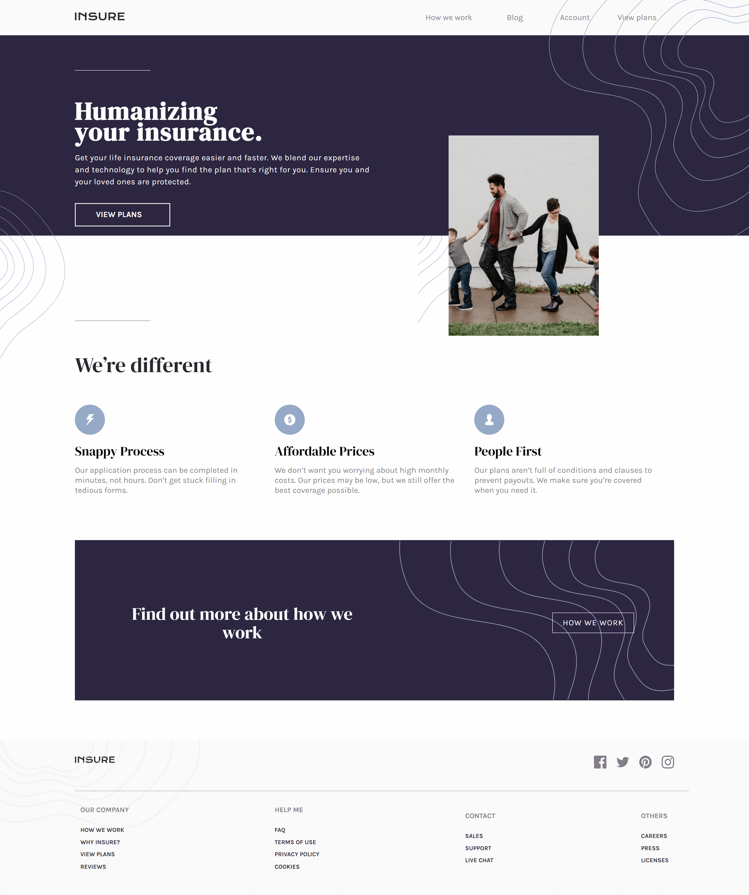

# Frontend Mentor - Insure landing page solution

## Table of contents
|
- [Overview](#overview)
  - [The challenge](#the-challenge)
  - [Screenshot](#screenshot)
  - [Links](#links)
- [My process](#my-process)
  - [Built with](#built-with)
  - [What I learned](#what-i-learned)
  - [Continued development](#continued-development)
- [Author](#author)
## Overview

### The challenge

Users should be able to:

- View the optimal layout for the site depending on their device's screen size
- See hover states for all interactive elements on the page

### Screenshot



### Links

- Solution URL: [https://github.com/anfer-code/landing-insurance](https://github.com/anfer-code/landing-insurance)
- Live Site URL: [https://anfer-code.github.io/landing-insurance/index.html](https://anfer-code.github.io/landing-insurance/index.html)

## My process

### Built with

- Semantic HTML5 markup
- CSS custom properties
- Flexbox
- CSS Grid
- Mobile-first workflow

### What I learned

It's my first time using JS to make a hamburger menu, i really f  eel good about the result.

To see how you can add code snippets, see below:

```js
let hamburguer = document.getElementById("hamburguer__img")
let list = document.getElementById("hamburguer__list")

function toogleClass() {
    if (list.classList.contains("hide")) {
        list.classList.remove("hide")
        list.classList.add("hamburger__list")
        hamburguer.classList.add("close")

    } else {
        list.classList.add("hide")
        list.classList.remove("hamburger__list")
        hamburguer.classList.remove("close")
    }
}
```

### Continued development

I'll do the next project in SASS, wish  me luck :D

## Author

- Github - [anfer-code](https://github.com/anfer-code)
- Frontend Mentor - [@anfer-code](https://www.frontendmentor.io/profile/anfer-code)
- Twitter - [@ValeraAnfer](https://twitter.com/ValeraAnfer)
